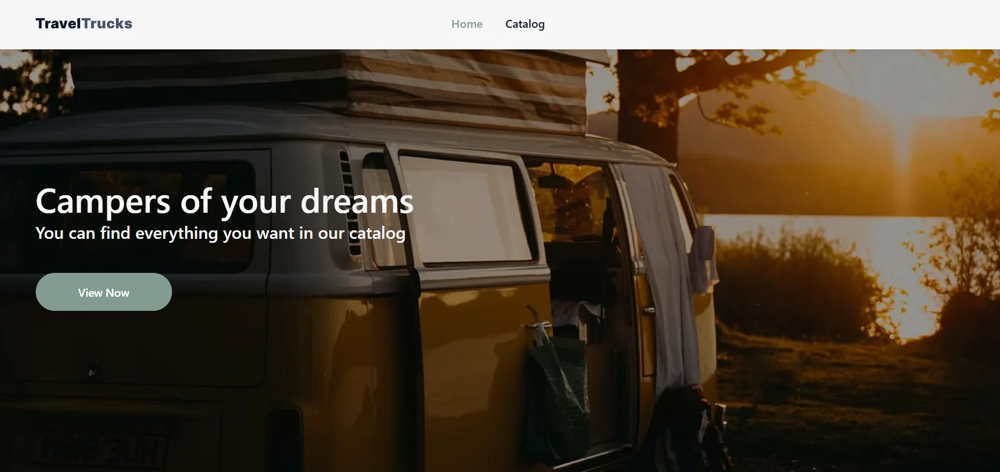

# 🚐 TravelTrucks

# 📖 Про проєкт

🌐 Live Page: Переглянути проєкт

TravelTrucks — це вебзастосунок для пошуку та оренди кемперів для подорожей.

Користувач може переглядати каталог доступних кемперів, фільтрувати їх за основними характеристиками, переглядати детальну інформацію про обраний кемпер, фотографії, технічні характеристики та відгуки, а також залишати заявку на бронювання.

Проєкт розроблено відповідно до дизайну у Figma з використанням Next.js, React та TypeScript.

# ✨ Основний функціонал

🏠 Головна сторінка

- Знайомство з сервісом TravelTrucks.
- Навігація до каталогу кемперів.

🚐 Каталог кемперів

- Перегляд списку доступних кемперів.
- Фільтрація за локацією.
- Фітрація за типом кузова, двигуна та трансмісії.
- Динамічне завантаження кемперів за допомогою Load more.
- Очищення всіх вибраних фільтрів за допомогою Clear filters.
- Коректне відображення стану, коли за заданими параметрами кемперів не знайдено.

🔍 Сторінка окремого кемпера

- Перегляд детальної інформації про кемпер.
- Галерея фотографій.
- Відображення основних характеристик.
- Інформація про комплектацію та зручності кемпера.
- Перегляд відгуків користувачів.
- Навігація між інформацією про кемпер та відгуками.

📅 Бронювання

- Форма для бронювання кемпера.
- Валідація введених даних.
- Відображення повідомлень про помилки.
- Відображення повідомлення про успішне надсилання заявки.

🎨 Інтерфейс

- Відповідність дизайну макету.
- Hover-ефекти та інтерактивні елементи.
- Toast-повідомлення для взаємодії з користувачем.

🔎 SEO

- Метадані для сторінки каталогу.
- Динамічні метадані для сторінок окремих кемперів.

# 🛠 Використані технології

| **Технологія**       | **Призначення**                                          |
| -------------------- | -------------------------------------------------------- |
| **Next.js**          | Фреймворк для розробки вебзастосунку                     |
| **React**            | Створення користувацького інтерфейсу                     |
| **TypeScript**       | Типізація та підвищення надійності коду                  |
| **TanStack Query**   | Керування серверним станом, кешування та отримання даних |
| **Axios**            | Виконання HTTP-запитів до API                            |
| **Formik**           | Керування станом форм                                    |
| **Yup**              | Валідація даних форм                                     |
| **CSS Modules**      | Локальна стилізація компонентів                          |
| **Swiper**           | Реалізація галереї зображень                             |
| **React Hot Toast**  | Відображення toast-повідомлень                           |
| **Next Image**       | Оптимізація зображень                                    |
| **next/font**        | Оптимізоване підключення шрифтів                         |
| **Modern Normalize** | Нормалізація стилів браузера                             |

# 🚀 Встановлення та запуск

1. Клонуйте репозиторій

   git clone https://github.com/TetianaMendel/travel-trucks.git

2. Перейдіть до папки проєкту

   cd travel-trucks

3. Встановіть залежності

   npm install

4. Запустіть проєкт у режимі розробки

   npm run dev

5. Після запуску відкрийте у браузері:

   http://localhost:3000

# 👩‍💻 Автор

Тетяна Мендель - Junior Full-Stack Developer

GitHub: https://github.com/TetianaMendel
LinkedIn: www.linkedin.com/in/tetianamendel/
